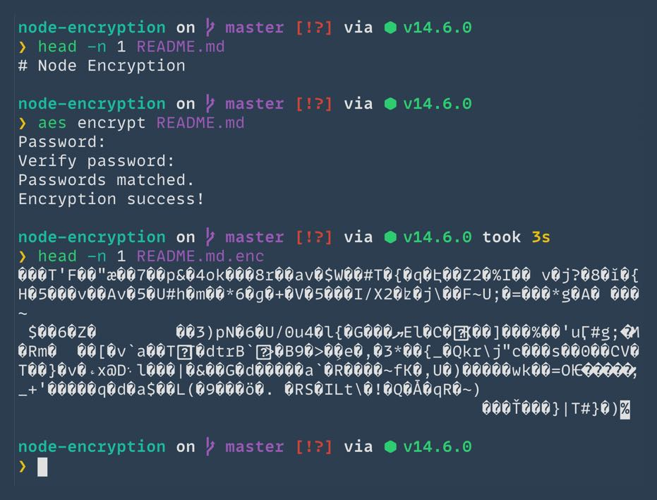

# AES CLI

An example of how one might encrypt/decrypt files using node.

Code for this companion article: [Encrypting Files With Node](http://brandonstilson.com/encrypting-files-with-node/).

## :exclamation: Important

This code is adapted from the original. The original repo can be found here: https://github.com/bbstilson/node-encryption

### Changelog

#### Added

- Add Node bin and Shebang to use as CLI tool. - [F1LT3R](https://f1lt3r.io)
- Add linting inputs and vscode settings. - [F1LT3R](https://f1lt3r.io)
- Add password, and password verification input. - [F1LT3R](https://f1lt3r.io)

#### Changes

- Use `scrypt` with salt instead of SHA256 hash.
- Changed algorithm to AES-256-GCM.
- Prompt is muted without rewrite.
- Do not allow blank password.

## Installation

```shell
npm install
```

## Usage

### Encryption

1. From your shell: `aes encrypt test.txt`
2. You will be prompted for a password, and password verification.
3. You will now see `test.txt.enc`. This is the encrypted data.
4. You can delete the original file, if you like.

### Decryption

1. From your shell: `aes decrypt test.txt`
2. You will be prompted for a password, and password verification.
3. You will now see `test-decrypt.txt`. This file will be identical to the original.
4. You can rename this file back to `test.txt`.
